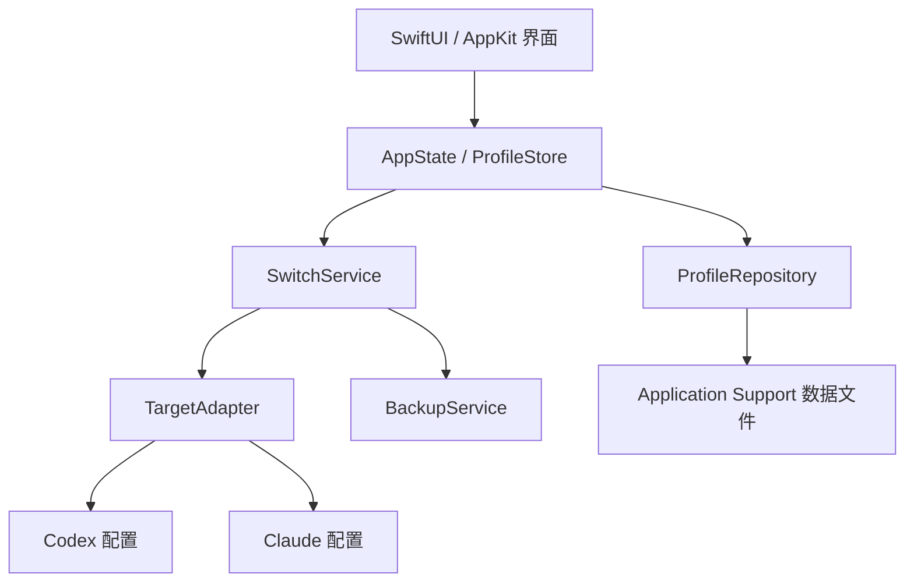

# 架构设计

## 设计原则

- 单一职责：应用只做订阅地址档案管理和本机配置切换。
- 显式边界：界面、领域逻辑、存储、目标配置写入分别隔离。
- 小状态源：当前档案、目标配置和切换结果只由一个 store 管理。
- 用户触发：除系统启动加载本地数据外，不做自动后台任务。
- 可测试：切换逻辑通过协议隔离文件系统和目标应用适配器。

## 分层

## 模块划分

### AppShell

- 管理菜单栏入口、设置窗口和应用生命周期。
- 不直接读写配置文件。
- 只调用状态层暴露的动作。

### ProfileStore

- 持有档案列表、当前启用档案、最近一次切换结果。
- 负责把界面动作转成领域服务调用。
- 保证界面只观察一个明确状态源。

### SwitchService

- 编排切换流程：校验、读取、备份、写入、验证、提交状态。
- 不关心界面，也不直接展示错误。
- 任一步失败都返回结构化错误。

### TargetAdapter

- 每个目标应用一个适配器。
- 负责定位目标配置、读取当前值、写入新值、验证写入结果。
- Codex 与 Claude 的实际配置路径必须通过真实环境验证后再固化。

### ProfileRepository

- 负责本地档案持久化。
- 使用 Codable 小文件保存非敏感元数据。
- 对敏感 URL 或令牌字段接入 Keychain。

### BackupService

- 切换前复制原始配置。
- 记录备份路径、时间、目标应用和来源档案。
- 回滚时只使用明确存在且校验通过的备份。

## 切换流程

1. 用户选择档案并触发切换。
2. `ProfileStore` 调用 `SwitchService`。
3. `SwitchService` 校验档案和目标适配器。
4. 适配器读取当前配置。
5. `BackupService` 创建备份。
6. 适配器写入新订阅地址。
7. 适配器重新读取并验证结果。
8. 成功后更新当前启用状态；失败则保留原状态并返回错误。

## 错误处理

- 配置路径不存在：提示用户目标应用尚未初始化或路径需要手动指定。
- 无写入权限：提示具体路径和权限问题。
- 写入后验证失败：提示写入位置与实际读取值不一致。
- 备份失败：停止切换，不继续写入。
- 网络检查失败：只影响检查结果，不影响本地档案保存。

## 并发模型

- UI 状态更新在主线程。
- 文件读写使用短任务，避免阻塞界面。
- 初期不引入复杂 actor 图，优先保持控制流可读。
- 不使用常驻任务、定时器或后台队列轮询。

## 可测试边界

- `SwitchService` 使用 mock adapter 验证成功、失败和回滚路径。
- `ProfileRepository` 使用临时目录验证读写。
- `TargetAdapter` 针对样例配置文件做集成测试。
- UI 层只验证关键状态流转，不承载配置写入逻辑。
